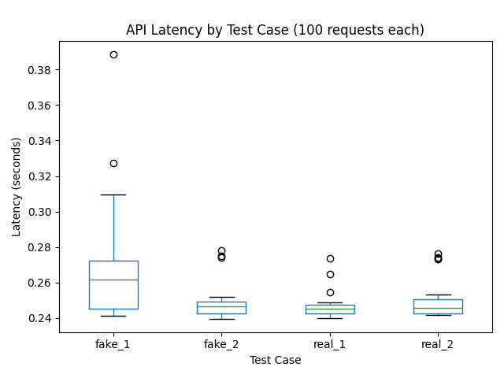

# Fake News Classifier

This project is a text classification system that predicts whether a news snippet is **real** or **fake**. It is built using a scikit-learn classifier and a count vectorizer, deployed via **Flask** on AWS Elastic Beanstalk. The repository also includes scripts to benchmark API latency.


## Usage

Create an instance on aws beanstalk, zip the files and deploy. Use all default settings.

### API Endpoints

* **GET /** — Health check.
* **GET /demo** — Simple web demo page with form input.
* **POST /predict** — JSON API endpoint:

```json
{
  "message": "Your text snippet here"
}
```

Response:

```json
{
  "label": "real"  // or "fake"
}
```

---

##  API testing

The `tests.py` script sends multiple (N) requests to the `/predict` endpoint and measures latency. It generates:

* `latency_results.csv`: latency data for each test case and iteration
* `latency_boxplot.png`: boxplot visualization of latency by test case

### Example Boxplot



---

## Unit Tests

`test_api.py` includes unit tests for the 4 sample news snippets:

* 2 fake news
* 2 real news

Run tests with:

```bash
python test_api.py
```

---

## Notes

* Make sure `basic_classifier.pkl` and `count_vectorizer.pkl` are in the same folder as `application.py`.
* Adjust `API_URL` in `tests.py` or `test_api.py` to point to your deployed API.

